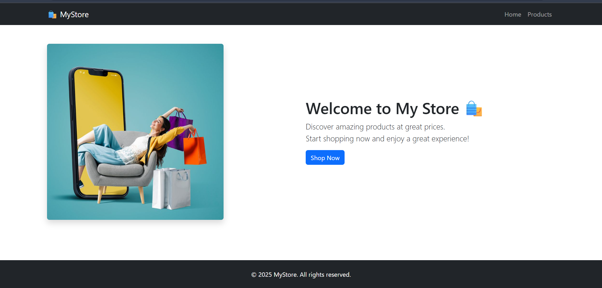
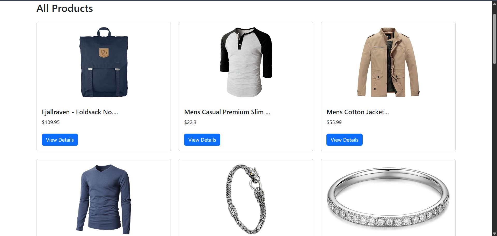
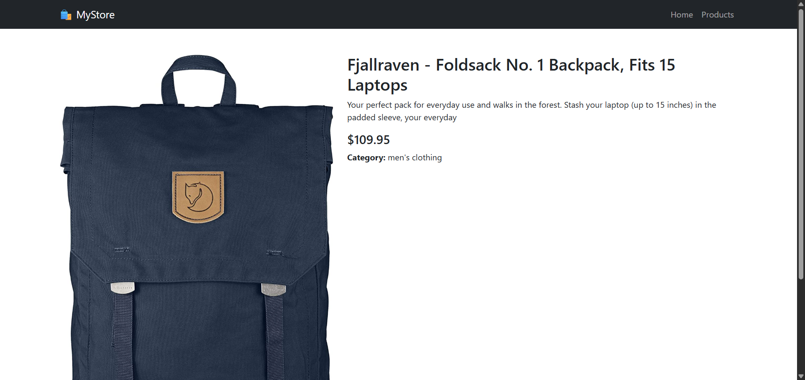
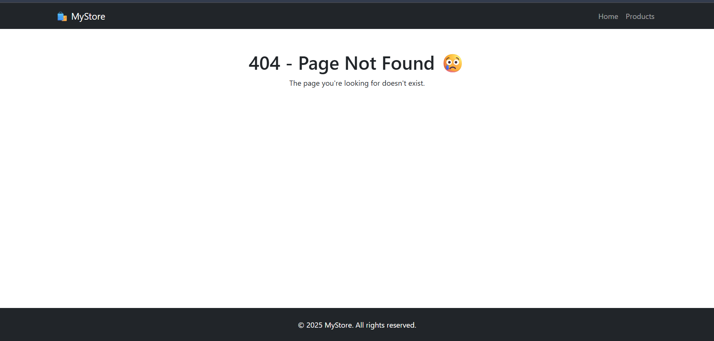

# 🛍️ MyStore Project

## 📋 Description
MyStore is a simple e-commerce web app built with React.  
It uses [FakeStoreAPI](https://fakestoreapi.com/) to fetch and display products in a user-friendly, responsive interface.

---

## 🧰 Technologies Used
- React
- React Router DOM
- Bootstrap
- Axios
- Vite (or Create React App)

---

## 📂 Project Structure

src/
├── components/
│   └── Navbar.jsx  
├── pages/
│   ├── Home.jsx  
│   ├── ProductList.jsx  
│   ├── ProductDetails.jsx  
│   └── NotFound.jsx  
├── App.jsx  
└── index.css  

---

## 📄 Pages

| Path            | Description             |
|-----------------|-------------------------|
| `/`             | Home page               |
| `/products`     | Product list page       |
| `/products/:id` | Product details page    |
| `*`             | 404 Not Found page      |

---

## 📷 Screenshots

> Put these in a folder called `/screenshots`

- 
- 
- 
- 

---

## ▶️ How to Run the Project

```bash
git clone https://github.com/YOUR_USERNAME/YOUR_REPO.git
cd my-store
npm install
npm run dev  # or npm start